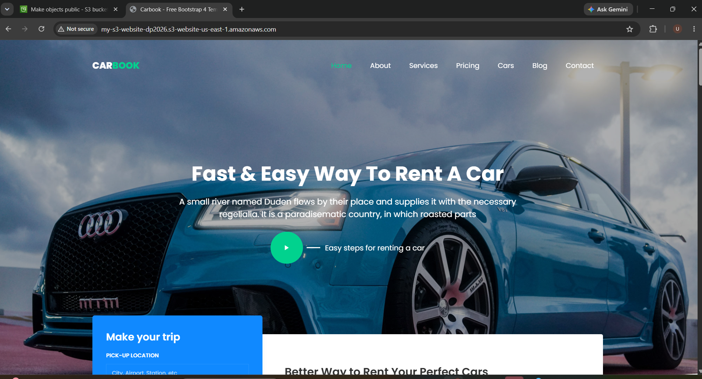

# 🚗 CarBook -- Car Rental Website

A responsive **Car Rental Website** built using HTML and CSS and
deployed as a static website on **Amazon S3**.

## 🌐 Live Website

**Live Demo:**
http://my-s3-website-dp2026.s3-website-us-east-1.amazonaws.com/

> Note: The website is currently hosted using Amazon S3 Static Website
> Hosting.

## 📌 Project Overview

CarBook is a static car rental website that provides users with a simple
and attractive interface to explore car rental services.

The website includes:

-   Home page with a hero section
-   Navigation menu
-   Car rental booking section
-   About section
-   Services section
-   Pricing section
-   Cars section
-   Blog section
-   Contact section
-   Responsive website design
-   Car-related images and visual content

## 🛠️ Technologies Used

-   **HTML5** -- Website structure
-   **CSS3** -- Styling and layout
-   **Amazon S3** -- Static website hosting
-   **Git & GitHub** -- Source code management

## ☁️ AWS Deployment

The website was deployed using **Amazon S3 Static Website Hosting**.

### Deployment Steps

1.  Created an Amazon S3 bucket.
2.  Uploaded the website files to the S3 bucket.
3.  Enabled **Static Website Hosting**.
4.  Configured `index.html` as the index document.
5.  Configured the required bucket permissions/policy for website
    access.
6.  Used the S3 static website endpoint to access the website from a
    browser.

## 📁 Project Structure

``` text
carbook/
│
├── index.html
├── css/
│   └── style.css
├── images/
│   └── website images
├── js/
│   └── script.js
└── README.md
```

> The exact folders may vary depending on the files used in the project.

## 🖥️ Website Preview

The project is a car rental landing website with a large hero section,
navigation bar, car imagery, and a rental booking section.

## 🎯 Project Objectives

-   Learn how to create a static website.
-   Understand Amazon S3 static website hosting.
-   Learn how to upload website files to an S3 bucket.
-   Understand basic AWS bucket configuration and permissions.
-   Learn Git and GitHub for project version control.
-   Deploy and access a website using an AWS S3 website endpoint.

## 🚀 How to Run Locally

1.  Clone this repository:

``` bash
git clone <YOUR_GITHUB_REPOSITORY_URL>
```

2.  Open the project folder.
3.  Open `index.html` in a web browser.

For a better local development experience, use a local web server such
as VS Code Live Server.

## 🔐 Security Notes

-   Do not upload AWS access keys, secret keys, passwords, `.pem` files,
    or other sensitive information to GitHub.
-   Keep AWS credentials outside the project repository.
-   Use an appropriate S3 bucket policy and permissions for static
    website hosting.

## 📚 What I Learned

Through this project, I learned:

-   Creating and managing an Amazon S3 bucket
-   Uploading static website files to S3
-   Configuring S3 Static Website Hosting
-   Making a website accessible through an AWS endpoint
-   Basic AWS permissions and bucket policies
-   Using Git for version control
-   Creating and maintaining a GitHub repository

## 👨‍💻 Author

**DurgaPrasad Setti**

------------------------------------------------------------------------

⭐ If you like this project, consider giving the repository a star!
## 🖥️ Website Preview

Here is a screenshot of the deployed CarBook website:



The website features a car rental landing page with a large hero section, navigation bar, car imagery, and a rental booking section.
